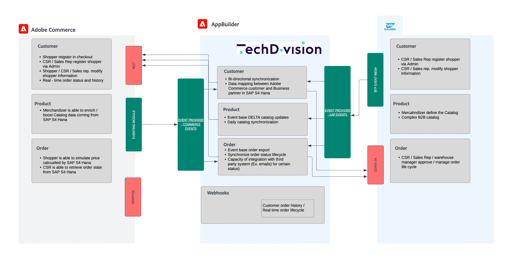
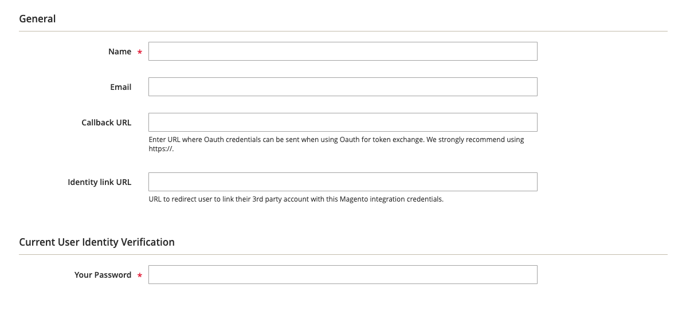
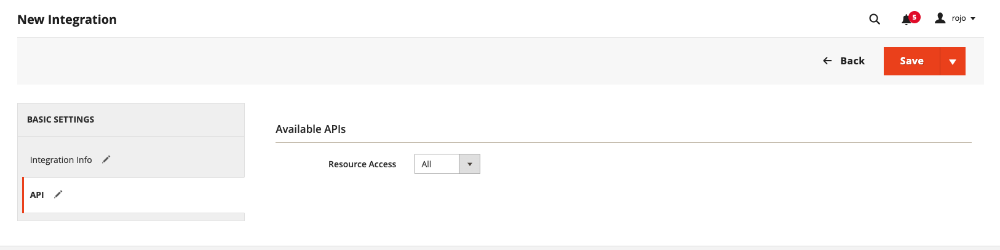
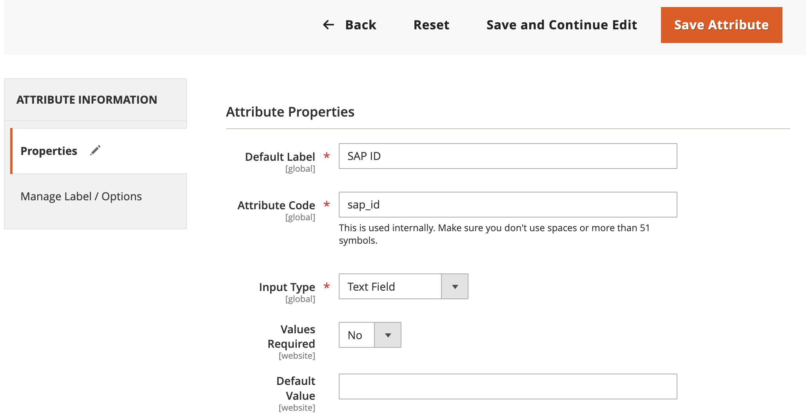
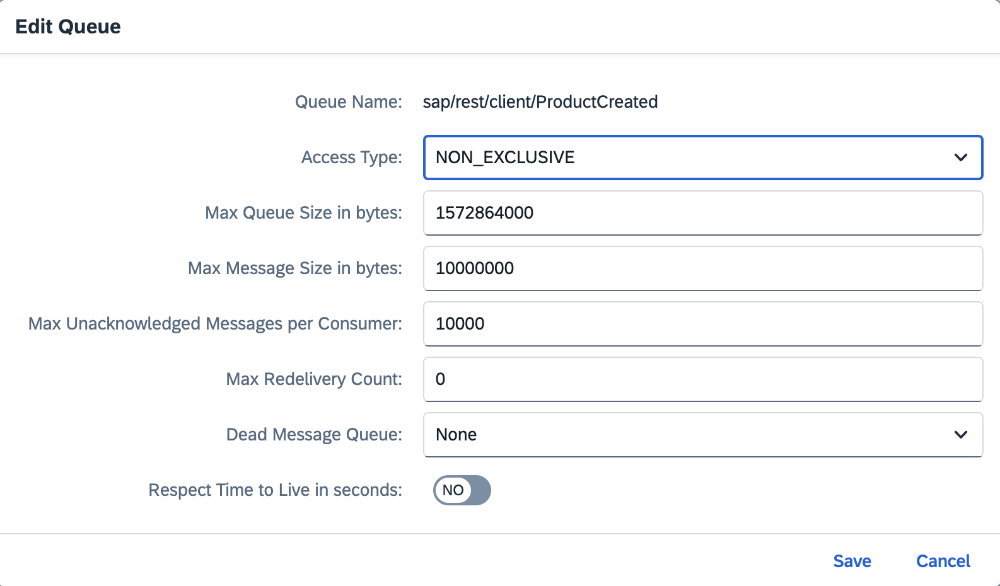
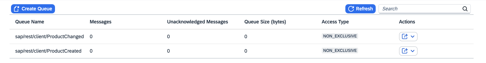
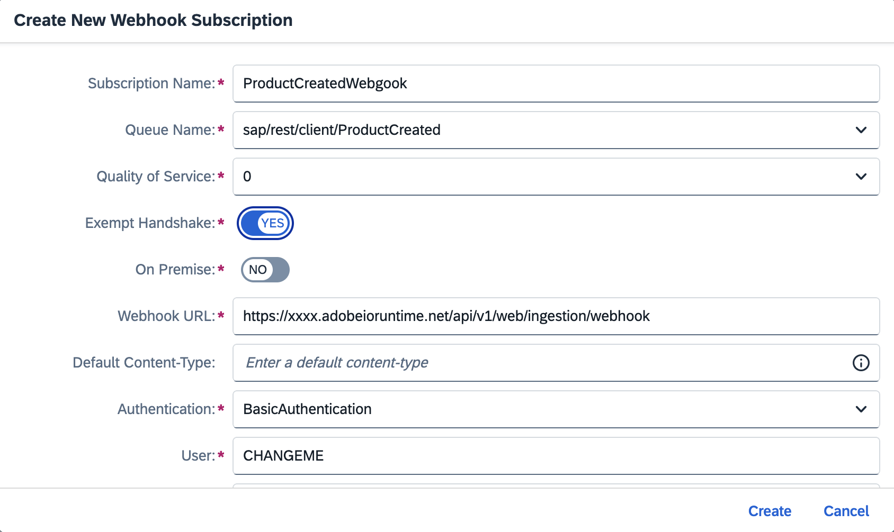
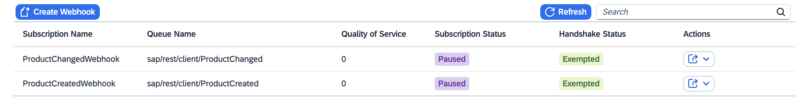

# SAP S/4 Hana Connector

[](https://github.com/techdivision/sap-s4hana-connector/actions/workflows/deploy_node_stage.yml)

Welcome to Adobe Commerce & SAP S/4HANA accelerator

This integration accelerator includes reference integrations for commonly used data flows data like orders, products,
and
customers. It also includes onboarding scripts and a standardized architecture for developers to build on following best
practices.


## Features

### Use Cases

The use cases demonstrate the feature set this connector is supporting. It is currently using a generic and very basic
data mapping
to transform the entities between Adobe Commerce and SAP S/4HANA. In every project the data attributes are very specific
on both
systems, therefore a more detailed data mapping should be done.

All data is mainly exchanged with events via I/O Events. If some systems are down there is
a [retry mechanism](https://developer.adobe.com/events/docs/support/faq/#what-happens-if-my-webhook-is-down-why-is-my-event-registration-marked-as-unstable)
which
allows events to be retried again.

**Customers**

- New customers in Adobe Commerce are synchronized to SAP
- Customer changes (including address) are synchronized to SAP
- New customers in SAP are synchronized to Adobe Commerce
- Customer changes in SAP are synchronized to Adobe Commerce

**Products**

- New products in SAP are synchronized to Adobe Commerce
- Product changes in SAP are synchronized to Adobe Commerce

**Orders**

- New orders in Adobe Commerce are synchronized to SAP
- Order status changes in SAP are synchronized to Adobe Commerce

**Webhooks**

- A webhook exposes the [order history](webhook/README.md) of a customer from SAP so that the data can be
  consumed in a headless frontend (including pagination)

### Infinite loop prevention for bidirectional sync flows

In bidirectional integrations, an infinite loop can occur when an event triggered in one system causes a change in
another system, which in turn triggers the same event back in the original system. This loop can continue indefinitely,
leading to excessive resource consumption and potential system failures.

To prevent infinite loops, the SAP S/4HANA Connector includes a mechanism that allows you to define a list of events
that could potentially trigger an infinite loop. When an event is triggered, the system checks if the event fingerprint
exists in the state-lib storage. If the fingerprint exists, the event is ignored. If the fingerprint does not exist, the
event is processed and the fingerprint is stored in the state-lib storage.

This functionality is implemented in the `src/utils/infiniteLoopPrevention.js` file.
The `isInfiniteLoop` function checks if the event fingerprint exists in the state-lib storage.
If the fingerprint exists, the function returns `true`, indicating that the event should be ignored.
The `setInfiniteLoop` function stores the event fingerprint in the state-lib storage.

Currently, the infinite loop prevention mechanism is implemented for the following events:

- `com.adobe.commerce.observer.customer_save_commit_after`, and
- `sap.s4.beh.businesspartner.v1.BusinessPartner.Changed.v1`, and
- `sap.s4.beh.businesspartner.v1.BusinessPartner.Created.v1`

in the `actions/customer/commerce/consumer.js` and `actions/customer/external/consumer.js` files.

## Prerequisites

### Create App Builder project

Go to the [Adobe developer console](https://developer.adobe.com/console) portal

- Click on `Create a new project from template`
- Select `App Builder`
- Chose a name and title
- Select stage workspace or create a new one
- Add the following API services (select default Oauth server to server)
    - I/0 events
    - Adobe I/O Events for Adobe Commerce
    - I/O management API
- Download
  the [workspace configuration JSON](https://developer.adobe.com/commerce/extensibility/events/project-setup/#download-the-workspace-configuration-file)
  file and save it as `workspace.json` in the `./scripts/onboarding/config` folder because you will use it
  to configure Adobe IO Events in commerce afterward.

### Configure a new Integration in commerce

Configure a new Integration to secure the calls to Commerce from App Builder using OAuth by following these steps:

- In the Commerce Admin, navigate to System > Extensions > Integrations.
- Click the `Add New Integration` button. The following screen displays
  
- Give the integration a name. The rest of the fields can be left blank.
- Select API on the left and grant access to all the resources.
  
- Click Save.
- In the list of integrations, activate your integration.
- To configure the project, you will need the integration details (consumer key, consumer secret, access token, and
  access token secret).

### Add a customer attribute for customer SAP ID

In Commerce Admin, navigate to `Stores > Attributes > Customer > Add New Attribute` and add a new customer attribute for
the SAP ID (for example `sap_id`)


### Install Commerce Eventing module (only required when running Adobe Commerce versions 2.4.4 or 2.4.5)

Install Adobe I/O Events for Adobe Commerce module in your commerce instance following
this [documentation](https://developer.adobe.com/commerce/extensibility/events/installation/)

> **Note**
>
> By upgrading the Adobe I/O Events for Adobe Commerce module to version 1.6.0 or greater, you will benefit from some
> additional automated steps during onboarding.

## SAP S/4HANA Connector deploy & onboarding

Following the next steps, you will deploy and onboard the SAP S/4 Hana Connector for the first time. The onboarding
process sets up
event providers and registrations based on your selection.

## SAP BTP Event Mesh configuration

SAP can send events once entities are changed or created in SAP via the BTP Event Mesh. You can follow
this [documentation](https://community.sap.com/t5/technology-blogs-by-members/enable-events-from-s-4hana-cloud-to-event-mesh/ba-p/13559401)
to set up SAP to send events to event mesh.

In the BTP event mesh you need to create queues and then webhooks. For every entity you need two of them: created and
updated. Follow
this [documentation](https://community.sap.com/t5/technology-blogs-by-sap/when-to-use-event-mesh-webhook/ba-p/13535830)
for further details on how to configure it.



After you deployed the runtime actions you will see the webhook url which you should use to create the webhooks in BTP
event mesh. The authentication is currently Basic Authentication, therefor you should select it. Username and password
are in the `.env` file.




### Download the project

- Download and unzip the project
- Copy the env file `cp env.dist .env`
- Fill in the values following the comments on the env file.

### Configure the project

Install the npm dependencies using the command:

```bash
npm install
```

### Generating the services definitions

1. Create service definitions by calling SAP metadata API, example for customers would be
   `{{sap-host}}/sap/opu/odata/sap/API_BUSINESS_PARTNER/$metadata`
2. Copy the XML to `service-specifications`
3. Ensure Node v20 is used
4. Execute
   `npx generate-odata-client -c service-specifications/generator-config.json`
   to generate the service classes

This step will connect your SAP S/4 Hana Connector project to the App builder project you created earlier.
Ensure to select the proper Organization > Project > Workspace with the following commands:

```bash
aio login
aio console org select
aio console project select
aio console workspace select
```

Sync your local application with the App Builder project using the following command:

```bash
aio app use --merge
```

### Deploy

Run the following command to deploy the project; this will deploy the runtime actions needed for the onboarding step:

```bash
aio app deploy
```

### Onboarding

This step will generate the IO Events providers and the registrations for your SAP S/4 Hana Connector project.
If your Commerce instance Adobe I/O Events for Adobe Commerce module version 1.6.0 or greater, the module will also be
automatically configured by the onboarding script.
To start the process run the command:

```bash
npm run onboard
```

### Subscribe to events in Adobe Commerce instance

> **Note**
>
> If your Commerce instance Adobe I/O Events for Adobe Commerce module version is 1.6.0 or greater, run the
> commerce-event-subscribe script to automatically subscribe to the Commerce events in
`scripts/commerce-event-subscribe/config/commerce-event-subscribe.json`
> ```bash
> npm run commerce-event-subscribe
> ```
> Otherwise, follow the steps below to subscribe to the events manually.

To subscribe to events, follow
this [documentation](https://developer.adobe.com/commerce/extensibility/events/configure-commerce/#subscribe-and-register-events).
